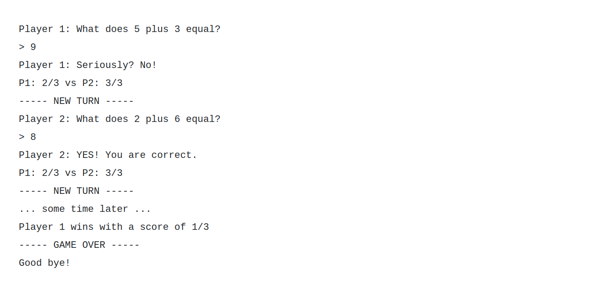

# Ruby Exercises

## Description
Create a 2-Player math game where players take turns to answer simple math addition problems. A new math question is generated for each turn by picking two numbers between 1 and 20. The player whose turn it is is prompted the question and must answer correctly or lose a life.

## Details

Both players start with 3 lives. They lose a life if they mis-answer a question. At the end of every turn, the game should output the new scores for both players, so players know where they stand.

The game doesn’t end until one of the players loses all their lives. At this point, the game should announce who won and what the other player’s score is.

<br>

## Expected Results
<br>


<br>
<br>

## Task 1: Extract Nouns for Classes 
<br>

- Player
- Game
- Question

<br>


## Task 2: Write their roles
<br>

What is the role for each class?

Write out a brief paragraph describing the role that class will play in your app.

<br>

The **_Question_** class will contain a method called get_question(name) that will by default return Player (1 or 2) => depending on players turn. The **_Player_** class will have 2 attributes (name and lives). It will trigger **_Game_** events. The **_Game_** will start, show_score, hold the value message of the winner of the **_Game_**, and hold the players_turn       


<br>

### If answer is correct

- Return message "Yes! You are correct." 
- Remove 1 point from opponent
- Display the current score ex. 

```sh
P1: 3/3 vs P2: 2/3 
```


<br>

### If answer is incorrect

- Return message "Seriously? No!"
- Remove 1 point from the player
- Display the current score ex. 


```sh
P1: 2/3 vs P2: 3/3 
```

<br>


